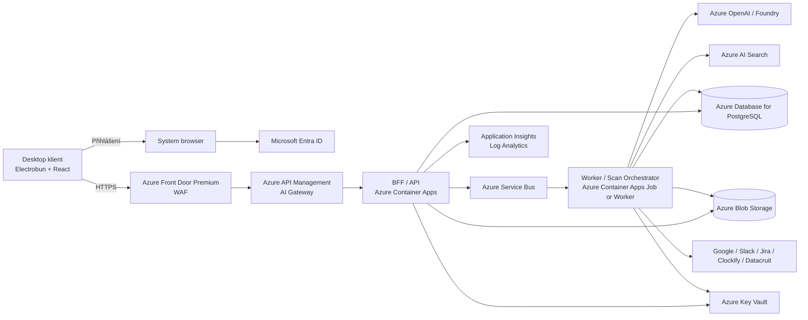
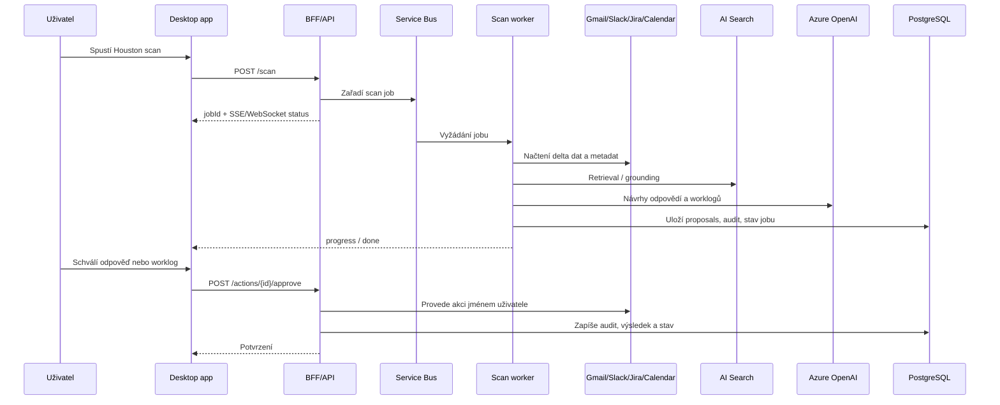

# Návrh bezpečné a udržovatelné aplikace nad Electrobunem a Azure

## Exekutivní shrnutí

Nejrozumnější cesta pro novou aplikaci na základě repozitáře **Electrobun** a přiložené specifikace Houstonu je postavit ji jako **tenký desktopový klient** nad **cloudovým řídicím backendem v Azure**. Elektrobun samotný je zajímavý pro rychlý, malý a cross-platform desktop shell: běží nad Bun, používá nativní bindingy, systémové webview nebo volitelně CEF, má vestavěný update mechanismus a dokumentovanou macOS code-signing/notarization cestu. Současně je ale potřeba vnímat, že jde o rychle se vyvíjející framework: hlavní větev repozitáře má beta verzi balíčku a repozitář veřejně nepublikuje `SECURITY.md`. Pro produkční systém s osobními a pracovně citlivými daty proto nemá být Electrobun „security boundary“, ale pouze UX vrstva. citeturn1view1turn2view0turn2view1turn6view0turn4view0turn3search16

Přiložená specifikace Houstonu ukazuje podstatně citlivější profil aplikace, než odpovídá běžnému desktop helperu. Systém agreguje Gmail, Slack, Google Calendar, Jira, Clockify, Datacruit a knowledge graph; umí generovat AI proposals, posílat odpovědi, logovat čas do Jiry a dnes ukládá významný stav do `~/.houston/` (`profile.yaml`, `state.yaml`, `policy.yaml`, `graph.db`, `episodes.db`) a částečně do `localStorage`. Specifikace navíc popisuje i automatické „auto-clean“ operace pro nižší tiery zpráv. To je v prototypu přijatelné, v produkci ale ne: desktopová aplikace je z pohledu identity **public client**, který nemůže bezpečně držet aplikací dokládaná tajemství, a OAuth pro desktop má být postaven na authorization code flow s PKCE, nikoli na lokálně uložených dlouhodobých secrets. citeturn34view1turn34view2  
Zdroj funkčního popisu: přiložený soubor `business-analysis.md`, zejména sekce 1–8.

Doporučuji proto tuto cílovou architekturu: **Electrobun + React/TypeScript na desktopu**, **server-side API/BFF a orchestrace v Azure**, **Microsoft Entra ID pro přihlášení do aplikace**, **server-side ukládání OAuth tokenů ke konektorům**, **Azure OpenAI za Azure API Management AI Gateway**, **PostgreSQL jako hlavní systém účtu**, **Azure AI Search pro retrieval a grounding**, **Blob Storage pro artefakty**, **Key Vault pro klíče a secrets**, **Private Endpoints**, **OpenTelemetry + Application Insights**, **Service Bus pro asynchronní běhy** a **Front Door Premium + WAF** pro veřejný vstup do API. Uživatel má zůstat „human in the loop“ pro všechny operace, které mění cizí systémy; automatické označování zpráv jako přečtených bych ve verzi v1 standardně vypnul nebo učinil explicitně opt-in. citeturn16view1turn16view2turn16view3turn29view0turn30view0turn30view1turn30view2turn30view3turn31view0turn31view1turn32view0turn33view1turn26search0turn26search4

Z pohledu GDPR je to **zpracování s vysokým rizikem**, nebo alespoň velmi pravděpodobný kandidát na DPIA: jde o novou technologii, soustavné agregování komunikace a pracovních dat napříč nástroji, generování AI návrhů, potenciální profilování priority/tierů a práci s náborovými daty v Datacruit. GDPR staví na zásadách minimalizace, omezení účelu, privacy by design/by default a přiměřeném zabezpečení; EDPB výslovně drží DPIA jako klíčový nástroj pro případy „likely high risk“ a český ÚOOÚ k čl. 35 GDPR publikuje metodiku i seznamy relevantních operací. citeturn20search1turn20search6turn20search8turn17search1turn20search2turn21view0

Moje hlavní doporučení je tedy jednoduché: **postavit „Azure-first control plane“, ne „desktop-first brain“**. To je nejbezpečnější, nejlépe auditovatelné a zároveň nejpraktičtější řešení pro tým bez hlubší předchozí zkušenosti s Azure.

## Co vyplývá z Electrobunu a ze současné specifikace Houstonu

Electrobun je technicky velmi schopný desktopový základ. Oficiální dokumentace jej popisuje jako framework pro malé, rychlé cross-platform desktop aplikace v TypeScriptu, s Bun runtime, nativními bindingy a možností použít systémové webview nebo volitelně CEF. Architektura počítá s Bun během v workeru, blokujícím GUI loopem v nativní vrstvě, IPC přes `postMessage`, FFI a v některých případech přes šifrované websockety. Dokumentace také popisuje vlastní bsdiff-based update mechanismus, distribuci přes statický host a automatizované code-signing/notarization workflow na macOS. citeturn1view1turn2view0turn2view1turn6view0

Právě tady ale začíná důležitý bezpečnostní trade-off. Electrobun je dnes vhodné číst jako **výkonný desktop framework**, nikoli jako plně prověřenou enterprise platformu ve stylu „bez dalších opatření stačí nasadit“. Hlavní balíček v repozitáři nese beta verzi, dokumentace a build workflow ukazují úzkou vazbu na konkrétní Bun/nativní toolchain verze a repozitář nemá zřízenou veřejnou security policy. To samo o sobě nemusí framework diskvalifikovat, ale znamená to, že v produkci je potřeba: oddělit doménu od desktop shellu, omezit lokální stav, zavést přísný update chain a počítat s vyšší investicí do integračních a bezpečnostních testů. citeturn4view0turn8view0turn5view0turn3search16

Další praktická implikace je velmi konkrétní: dokumentace Electrobunu uvádí, že **custom URL schemes** jsou plně podporované na macOS, ale na Windows a Linuxu ještě ne. Pokud tedy aplikace potřebuje cross-platform OAuth návraty z browseru, není rozumné navrhnout autentizaci kolem custom URI schématu jako jediného mechanismu. V produkčním návrhu bych pro desktop login i connector onboarding stavěl na **system browser + authorization code flow with PKCE + loopback callback** nebo na brokered/podporované platformní variantě, ne na app-specific deep-linku závislém na jediné platformě. citeturn6view1

Přiložená specifikace Houstonu je po byznysové stránce velmi cenná, ale současně vysvětluje, proč nestačí „jen přepsat frontend“. Houston není obyčejný inbox. Je to osobní produktivitní hub s unifikovaným inboxem, worklogy, kalendářem, projekty a diagnostickou „Context“ částí; navíc obsahuje AI scan, který dnes spouští subprocess `claude -p "/houston"`, čte historická data, dělá tiering, generuje návrhy odpovědí a ukládá proposals i missing worklogs do lokálního stavu. Zdrojová data přitom sahají od e-mailů a Slacku až po ATS a knowledge graph. Zdroj: přiložený soubor `business-analysis.md`, sekce 1–8.

Z bezpečnostního hlediska jsou ve stávajícím konceptu nejproblematičtější čtyři věci. Zaprvé, **lokální persistence** citlivého stavu a kontextu na uživatelském zařízení. Zadruhé, **přímé mutace cizích systémů** z AI-driven workflow. Zatřetí, **Context stránka** s poměrně přímým CRUD přístupem na databázové tabulky. Začtvrté, **auto-clean tier 4–5**, tedy automatické označování položek jako přečtených bez explicitního lidského kroku. Právě tyto čtyři oblasti je potřeba v nové verzi zásadně přepracovat. Zdroj: přiložený soubor `business-analysis.md`, sekce 3, 5, 7, 8.

Proto navrhuji toto pravidlo: **vše, co mění externí systém, pracuje s connector tokeny, ukládá auditní stopu nebo používá LLM pro rozhodovací logiku, musí běžet server-side**. Desktop má být především prezentační a interakční vrstva. To odpovídá i modelu Microsoft identity platform: desktop je public client bez schopnosti bezpečně držet client secret, zatímco backend a Azure služby mají používat managed identities, RBAC a server-side token exchange. citeturn34view2turn34view1turn30view0turn29view0

### Co zachovat a co změnit

| Oblast | Zachovat | Změnit |
|---|---|---|
| UX | Unified inbox, Work panel, proposals, rychlé logování času, třípanelový dashboard | Přesunout business logiku a integrace do cloudu |
| AI | Návrhy odpovědí, návrhy worklogů, scan komunikace | Zrušit lokální subprocess orchestrace; nahradit server-side LLM gateway a workerem |
| Stav | Lehký lokální UI stav | Zakázat lokální uložení citlivých dat a tokenů |
| Integrace | Gmail, Slack, Calendar, Jira, Clockify, Datacruit | OAuth tokeny ukládat jen server-side; konektory auditovat |
| Admin/diagnostika | Controlled troubleshooting pohled | Omezit přímý DB CRUD; dát jej jen do admin support plane s RBAC a auditem |
| Automatizace | Human-in-the-loop proposals | Auto-execute a auto-mark-read dát do opt-in režimu až po DPIA a bezpečnostním schválení |

Tabulka je návrhové doporučení založené na přiložené specifikaci Houstonu a na veřejně zdokumentovaných vlastnostech Electrobunu. Electrobun je vhodný jako shell; konektory, secrets a AI orchestrace ale mají z bezpečnostních důvodů patřit do backendu. citeturn2view0turn6view0turn34view2

## Doporučená cílová architektura

Doporučená cílová architektura je **modulární monolit s event-driven hranami**, nikoli mikroslužbový roj. Důvod je jednoduchý: uživatel nespecifikoval vysokou škálu, tým nemá zkušenost s Azure a aplikace má být udržovatelná. Modulární monolit vynutí čisté vrstvy a doménové hranice, ale nebude přidávat zbytečný provozní overhead. Event-driven prvky – zejména scan joby, connector synchronizace, importy, retry a notifikace – se vyplatí řešit přes queue a workery. Azure Container Apps dávají pro tento model velmi dobrý kompromis mezi jednoduchostí, škálováním a bezpečností; podporují managed identities a bezpečnostní best practices pro kontejnerové aplikace. citeturn11search0turn15search2turn15search6

### Referenční vrstvy

Navrhuji šest vrstev:

**Desktop layer.** Electrobun aplikace s React/TypeScript rendererem, velmi omezeným bridge API a nulovým přístupem k dlouhodobým secrets. Sign-in přes system browser. Lokální cache jen pro neškodný UX stav a případně krátkodobý encrypted offline cache bez citlivých payloadů. Custom scheme nepoužívat jako jediný cross-platform callback mechanismus. citeturn6view1turn34view1turn34view2

**Edge/API layer.** Azure Front Door Premium + WAF jako veřejný edge, za ním Azure API Management jako standardní API gateway a zároveň AI gateway pro Azure OpenAI. Front Door Premium umí Private Link k podporovaným originům a Azure WAF je postavený na OWASP CRS/DRS. APIM umí autentizaci k AI backendům přes managed identity, OAuth předautorizaci, token quotas, logování promptů/completions a další guardrails. citeturn26search0turn26search4turn13search2turn29view0turn29view2turn16view2

**Application/BFF layer.** Jedna hlavní API aplikace, která drží doménová pravidla, presentation DTO, autorizaci, auditní logiku a orchestrace vstupů/výstupů. Zde patří i approval workflow pro odeslání odpovědí, logování času a administrativní rozhodnutí.

**Worker/orchestration layer.** Asynchronní worker nebo joby nad Service Bus. Tady běží connector sync, Houston scan, normalizace dat, retrieval pipeline, scoring relevance/tierů a generování návrhů. Worker musí být idempotentní a auditovatelný.

**Data layer.** PostgreSQL Flexible Server jako system of record, Blob Storage pro větší artefakty, Azure AI Search pro retrieval/grounding. Tokens a kryptografický materiál v Key Vault; konfigurace nebo feature flags mimo tajemství lze držet odděleně.

**Security/observability plane.** Entra ID, RBAC, Conditional Access, Key Vault, Application Insights, Log Analytics, Azure Monitor, Defender for Cloud/DevOps security.

### Referenční architektura

Níže je doporučená logická topologie. Diagram zachycuje doporučený vzor, ne hotové jmenné konvence.



Tento návrh odpovídá tomu, co dnes Azure a Microsoft Learn považují za bezpečné minimum pro AI workloady: private endpoints pro Azure OpenAI a další PaaS služby, managed identities místo API keys, APIM jako centrální governance bod a observability přes Application Insights/OpenTelemetry. Azure OpenAI i „Direct models“ v Foundry zároveň deklarují, že customer prompts, completions a fine-tuned modely nejsou použity k trénování foundation modelů bez svolení/instrukce zákazníka a nejsou sdíleny s jinými zákazníky ani s OpenAI mimo Azure službu. citeturn16view1turn16view3turn30view0turn30view2turn30view3turn16view2turn16view0turn9search4

### Tok dat pro Houston scan a provedení akce



Zásadní bezpečnostní princip v tomto toku je, že **LLM nikdy neprovádí side-effect akci napřímo**. LLM navrhne, člověk schválí, backend validuje business pravidla, teprve pak teče mutující request do externího systému. To výrazně snižuje riziko prompt injection, nechtěných akcí a právních sporů o to, „kdo co poslal“. Tento vzor je zároveň konzistentní s principem privacy by design a s doporučením držet human oversight nad rizikovější automatizací. citeturn17search14turn17search3turn22search3turn22search11turn23search0turn23search3

### Doporučené Azure služby

| Oblast | Doporučená služba | Proč |
|---|---|---|
| Přihlášení | Microsoft Entra ID | Jednotná identita, MFA, RBAC, Conditional Access |
| Veřejný edge | Azure Front Door Premium + WAF | WAF, Private Link k originům, globální edge |
| API gateway | Azure API Management | OAuth předautorizace, AI governance, token quotas, central policy |
| Synchronous API | Azure Container Apps | Dobrá rovnováha mezi jednoduchostí a container flexibility |
| Async orchestrace | Azure Service Bus + ACA worker/job | Spolehlivé queueing, retry, oddělení scanů |
| LLM | Azure OpenAI v Foundry / Azure OpenAI resource | Enterprise governance, RBAC, private networking |
| Retrieval | Azure AI Search | Hybrid, semantic ranking, agentic retrieval |
| Relational store | Azure Database for PostgreSQL Flexible Server | Relace, audit, pgvector možnost, Entra auth |
| Artefakty | Azure Blob Storage | Levné a bezpečné úložiště, lifecycle, versioning |
| Secrets/keys | Azure Key Vault | Centralizovaná správa secrets, certifikátů a klíčů |
| Monitoring | Application Insights + Log Analytics + Azure Monitor | Telemetrie, alerting, dotazování, dashboards |

Podpůrná fakta: Azure AI Search umí private endpoints, hybrid search a semantic ranking; PostgreSQL Flexible Server podporuje Microsoft Entra authentication, token-based auth a má data i backupy šifrované v klidu; Key Vault doporučuje RBAC model a Front Door Premium umí Private Link k podporovaným originům. citeturn30view3turn24search1turn24search2turn24search3turn31view2turn31view1turn31view0turn33view1turn26search0turn26search4

### Vzor resource topology

Pro produkci bych rozdělil Azure resource groups přibližně takto:

```text
rg-houston-net-prod
  vnet-houston-prod
  snet-private-endpoints
  snet-containerapps
  private-dns-zones

rg-houston-edge-prod
  afd-houston-prod
  apim-houston-prod
  law-houston-prod
  appi-houston-prod

rg-houston-app-prod
  aca-api-prod
  aca-worker-prod
  sb-houston-prod

rg-houston-data-prod
  pg-houston-prod
  sthoustonprod
  search-houston-prod
  aoai-houston-prod
  kv-houston-prod
```

Region uživatel nespecifikoval, proto bych v návrhu pracoval s placeholdery **`<EU-primary>`** a **`<EU-secondary>`** a definitivní výběr udělal až po ověření aktuální regionální dostupnosti požadovaných modelů a funkcí. Microsoft výslovně uvádí, že dostupnost modelů se liší podle regionu, a private endpoint či Search networking také předpokládají regionálně kompatibilní návrh. citeturn28view1turn30view3turn16view3

## Technologická rozhodnutí a trade-offy

### Desktop framework

Moje doporučení není „Electrobun bez výhrad“, ale **Electrobun s přísně omezenou rolí**. Pokud je rozhodnutí „musíme stavět na Electrobunu“, potom je to přijatelné za předpokladu, že desktop nenese tajemství, neobsahuje rozhodovací mozek a že rendering/IPC surface bude tvrdě zúžená. Pokud je framework ještě otevřená volba, Tauri je dnes bezpečnostně velmi silná alternativa a Electron zůstává nejzralejší ekosystémová volba.

| Varianta | Doporučení pro tento projekt | Silné stránky | Slabé stránky |
|---|---|---|---|
| **Electrobun** | **Ano, ale jen jako thin shell** | TypeScript/Bun ergonomie, malý footprint, rychlost, vestavěný updater | Vyšší framework risk, menší enterprise track record, nutnost vlastního hardeningu |
| **Tauri** | Silná alternativa, pokud rámec lze změnit | Secure-by-default mindset, povinně podepsané aktualizace, menší attack surface | Jiný stack a vyšší migrační odklon od zadaného repa |
| **Electron** | Jen pokud je kritická zralost ekosystému | Obrovský ekosystém, mnoho nástrojů a know-how | Vyšší resource footprint, bezpečnost vyžaduje důsledné nastavení sandboxu/IPC |

Objektivní fakta k tomuto srovnání jsou poměrně jasná: Tauri oficiálně zdůrazňuje security-first design a jeho updater vyžaduje podpis aktualizace, který nelze vypnout. Electron naopak dokumentuje, že vypnutí sandboxu nese bezpečnostní rizika, a jeho vestavěný `autoUpdater` podporuje pouze macOS a Windows. Electrobun má naopak vlastní update mechanismus z dokumentace založený na statickém hostingu a hash/patch toku, takže u něj doporučuji doplnit vlastní kryptograficky podepsaný release manifest a hlubší release governance. citeturn36search1turn36search2turn36search0turn36search19turn2view0turn2view1

**Doporučení:** zůstat u Electrobunu, ale architektonicky se pojistit tak, aby bylo možné shell v budoucnu nahradit Tauri bez přepisování backendu, domény a connector vrstvy.

### Renderer a desktop bezpečnostní profil

Doporučuji **výchozí systémové webview** a ne CEF, pokud nenajdete konkrétní funkční blokátor. Systémové webview snižuje velikost balíku i počet aktualizovaných komponent; CEF zapínejte jen tam, kde opravdu potřebujete render parity nebo Chromium-only vlastnosti. V rendereru žádné přímé file-system, shell nebo network privilegované operace; pouze úzké, typed bridge API. Vkládání externího webového obsahu minimalizovat; pokud je nezbytné, používat izolovaný webview proces a striktní allowlist. Electrobunův OOPIF-style `<electrobun-webview>` je plus, ale bezpečnostně nestačí jako omluva pro „embedneme všechno“. citeturn8view0turn8view1turn7view2

### Backend hosting

| Varianta | Doporučení | Kdy zvolit |
|---|---|---|
| **Azure Container Apps** | **Primární volba** | API + worker + jobs, tým bez Kubernetes, potřeba VNet a managed identity |
| **Azure App Service** | Rozumná alternativa pro jednodušší API | Pokud chcete co nejjednodušší web hosting a minimální container orchestration |
| **AKS** | Ne pro v1 | Pokud už existuje platform team a požadujete plnou kontrolu nad Kubernetes |

Container Apps podporují consumption/dedicated/flex workload profiles, managed identities a bezpečnostní best practices pro kontejnerové workloady; App Service je velmi jednoduchý pro web apps a REST API a umí managed identity i private endpoints; AKS přináší nejvyšší flexibilitu, ale i nejvyšší provozní overhead. Pro tento projekt bych vzal první variantu. citeturn11search0turn15search2turn15search6turn25search2turn11search5turn25search7

### Datová vrstva a retrieval

| Potřeba | Doporučená technologie | Poznámka |
|---|---|---|
| Hlavní transakční data, audit, proposals, approvals, projekty, konektory | **Azure Database for PostgreSQL Flexible Server** | System of record |
| Full-text + vector + semantic + RAG grounding | **Azure AI Search** | Pro enterprise retrieval a grounding |
| Menší embedding use-cases přímo u relací | `pgvector` v PostgreSQL | Dobrý doplněk, ne vždy náhrada za Search |
| Velký noSQL/vector scale-out | Cosmos DB | Ne pro v1, pokud není jasný předpoklad hyperscale |

Azure PostgreSQL podporuje Entra auth, token-based přístup a pgvector; Azure AI Search nabízí hybrid search, semantic ranking i agentic retrieval. Pro tento systém nedoporučuji ideologii „jeden store na všechno“. Proposals, approvals, audit a connector state mají být v PostgreSQL. Textové a knowledge retrieval use-cases mají jít do AI Search. Embeddings a indexy je přitom nutné právně i bezpečnostně považovat za data, nikoli za „neškodné metadata“. citeturn31view2turn31view3turn24search0turn24search1turn24search2turn24search3turn24search9turn25search0

### Azure LLM integrace

Největší praktický omyl v podobných projektech bývá „desktop bude volat model napřímo“. Pro toto zadání to **nedoporučuji**. Lepší jsou tři varianty:

| Varianta | Hodnocení | Kdy dává smysl |
|---|---|---|
| **Backend → Azure OpenAI přímo** | Dobrá minimální varianta | Malý systém bez centrální AI governance |
| **Backend → APIM AI Gateway → Azure OpenAI** | **Doporučená v1** | Potřebujete quotas, central policy, logging, auth, content safety |
| **Foundry Agent Service + AI Search / Foundry IQ** | Doporučené k pilotu ve fázi 2 | Pokročilí agenti, znalostní báze, složitější tool orchestrace |

APIM AI Gateway dnes umí pro AI endpointy autentizaci přes managed identity, OAuth-based autorizaci, content safety politiky, load balancing, circuit breaker, logging promptů/completions a token quotas/metrics. Foundry Agent Service je plně spravovaná platforma pro AI agenty a umí i scénář „use your own resources“ kvůli CMK a network isolation. Přesto bych u tohoto projektu, kvůli požadavku na auditovatelné akce a nižší Azure zkušenosti, šel ve verzi v1 cestou **APIM + explicitní backend orchestrace**, nikoli hned plně agentické autonomy. citeturn29view0turn29view2turn16view2turn35search0turn35search12turn35search9

### Praktický modelový mix

Pro tento typ aplikace bych doporučil pragmatický mix:

| Úloha | Modelový typ | Návrh |
|---|---|---|
| Rychlé odpovědi, shrnutí, UI suggestions | Fast general model | **GPT-4.1** nebo menší varianta |
| Složitější reasoning nad více kroky a plánování | Reasoning model | **GPT-5** nebo menší reasoning varianta |
| Retrieval pipeline | Search + grounding | AI Search + omezený context window |
| Bezpečnostní filtr vstupů/výstupů | Guardrails | AI Content Safety + OpenAI content filters + Prompt Shields |

Microsoft dnes sám popisuje GPT-4.1 jako vhodný pro rychlé, vysokoprůchodové enterprise use-cases s nízkou latencí a GPT-5 jako model pro hlubší reasoning, plánování a složitější enterprise copilot scénáře; model availability se ale mění podle regionu a deployment policy, takže finální výběr musí být ověřen v cílovém regionu. citeturn28view0turn28view1turn28view2

## Bezpečnost, threat model a GDPR

### Základní principy, které mají být nepřekročitelné

Nová aplikace má z bezpečnostního hlediska stát na pěti pravidlech.

První pravidlo je **least privilege**. Desktop klient dostane jen to, co nutně potřebuje pro přihlášení a UI. Backend služby se ověřují přes managed identity, přístup ke Key Vaultu je řízen RBAC a nikdo s běžným `Contributor` oprávněním nesmí být schopen se „dopracovat“ k data-plane přístupu jen přepnutím access policies. Microsoft u Key Vaultu přímo doporučuje RBAC model a upozorňuje, že access policies mohou vytvořit nežádoucí eskalaci. citeturn33view1turn30view1turn33view2

Druhé pravidlo je **network isolation**. Azure OpenAI, AI Search, Storage, PostgreSQL a Key Vault mají být dosažitelné přes private endpoints; veřejný internet má končit na Front Door/WAF a dál má provoz téct po Microsoft backbone. To platí zvlášť pro LLM a pro retrieval služby, protože do nich teče nejcitlivější payload. citeturn16view3turn30view2turn30view3turn26search0turn26search4

Třetí pravidlo je **human approval pro side effects**. Odeslání e-mailu/slack reply, logování času, mazání či archivace se nesmí spouštět jen na základě modelového výstupu. Všechny tyto akce mají jít přes schválení člověkem a server-side validaci. To je důležité jak pro bezpečnost, tak pro audit a GDPR. Zdroj k současným use cases: přiložený soubor `business-analysis.md`, sekce 3 a 8.

Čtvrté pravidlo je **data minimization and retention by design**. Do vyhledávacích indexů, embeddingů, audit logů a telemetry nepatří „všechno“. Proposals by měly nést odkaz na zdrojový objekt a jen nezbytné výřezy textu; plné raw bodies, přílohy a detailní prompt logy mají mít kratší retention a přísnější přístup. GDPR stojí na zásadách omezení účelu, minimalizace a privacy by design/by default. citeturn20search6turn17search14turn17search3

Páté pravidlo je **LLM as helper, not authority**. Prompty, retrieved dokumenty i connector data jsou ne-důvěryhodný vstup. Prompt injection a document attacks dnes Azure explicitně řeší pomocí Prompt Shields a APIM umí vkládat content safety policy do AI toku. Řídicí logika, která rozhoduje o tom, co je „dovoleno udělat“, nesmí být zakódována jen v promptu. citeturn22search3turn22search11turn23search0turn23search7turn23search3

### Threat model

Níže je praktický threat model vycházející z OWASP Top 10 perspektivy, LLM hrozeb a privacy rizik.

| Asset / tok | Hrozba | Relevance | Konkrétní kontrola |
|---|---|---|---|
| Desktop session | Únik tokenu nebo session hijack | Vysoká | PKCE, system browser, krátké session, secure local storage, device-bound policy |
| API/BFF | Broken access control | Vysoká | Entra JWT validace, app roles, tenant isolation, authorization i na objektové úrovni |
| Connector tokens | Krádež refresh tokenů | Kritická | Server-side storage only, envelope encryption, Key Vault, rotace a revoke flow |
| LLM prompt tok | Prompt injection / jailbreak | Kritická | Prompt Shields, content safety, allowlisted tools, human approval, deterministic policy engine |
| Retrieval index | Data leakage přes search/RAG | Vysoká | Source ACL filtering, per-user document scopes, minimization, no broad raw dumps |
| Update chain | Supply-chain útok | Vysoká | Code signing, signed release manifest, pinned channels, artifact integrity validation |
| Context/admin UI | Insecure direct object access / mass assignment | Vysoká | Samostatná admin plane, RBAC, audit, zákaz přímého CRUD pro běžné uživatele |
| Telemetrie | Logging failure nebo PII leakage do logů | Vysoká | Redakce, sampling, oddělené workspace, krátká retention, role-based log access |
| Blob/artifacts | Neoprávněné čtení/smazání | Vysoká | Private endpoints, CMK dle potřeby, soft delete, versioning, immutable policy pro auditní snapshoty |
| Datacruit / HR data | GDPR privacy risk | Kritická | Samostatná data category, DPIA, omezení use-case, kratší retention, přísnější approval |

Tento model je záměrně konzervativní. U AI aplikací bývá nejdražší chyba ne SQL injection, ale tiché smíchání identity, konektorového oprávnění, retrieval vrstvy a neauditovaného modelového rozhodnutí. OWASP ASVS zůstává vhodným baseline security verification frameworkem pro web/API část a OWASP prompt injection guidance je vhodný baseline pro AI část. citeturn22search0turn22search3turn22search11

### Konkrétní bezpečnostní kontroly

#### Identita a autentizace

Desktop aplikace má být registrovaná jako **public client** v Entra ID. Přihlášení stavět na authorization code flow s PKCE a podporované MSAL knihovně. Conditional Access doporučuji minimálně pro MFA; u administrativních rolí nebo podpory navíc vyžadovat compliant device. Pro API používat samostatnou app registration a app roles. Pro workloady v Azure používat managed identities místo API keys. citeturn34view1turn34view2turn34view3turn30view0

#### Secrets management

Všechny secrets, certifikáty a klíče v Key Vaultu. Přístup řídit přes Azure RBAC, nikoli legacy access policies. Microsoft doporučuje „vault per application per environment“, roles na úrovni vault scope a purge protection. Key Vault soft-delete je defaultně zapnutý; purge protection je potřeba explicitně zapnout a je doporučená zejména tam, kde vault chrání šifrovací klíče jiných služeb. citeturn30view1turn33view1turn33view0

#### Šifrování v klidu a při přenosu

Azure Database for PostgreSQL vždy šifruje data v klidu; to se týká i backupů. Azure Storage šifruje všechna data v účtu a podporuje Microsoft-managed i customer-managed keys; pro vyšší jistotu umí i double encryption na infrastrukturní vrstvě. V přenosu držet TLS-only vstupní body a zakázat nešifrované protokoly. Pro citlivější tenanty lze zapnout CMK pro Storage a PostgreSQL; pro většinu v1 scénářů je ale důležitější správně vyřešený IAM a network isolation než „honba za HSM“ bez datové klasifikace. citeturn31view1turn31view0turn32view0turn15search8turn15search12

#### Data governance a retention

Pro payloady doporučuji následující model:

| Datový typ | Kde | Doporučená retention |
|---|---|---|
| Connector tokens | PostgreSQL/secret envelope + Key Vault | Do odpojení zdroje nebo revokace |
| Proposals a approval metadata | PostgreSQL | 90–180 dnů podle auditu |
| Raw message body / attachments | Blob | Krátce, např. 7–30 dnů, pokud není právní důvod držet déle |
| Audit trail akcí | PostgreSQL + export | Delší retention dle interní politiky |
| Search index / embeddings | AI Search / pgvector | Jen nezbytná data, průběžná reindexace a výmaz |
| Telemetrie | App Insights / Log Analytics | Krátká retention, pseudonymizace, bez plných promptů defaultně |

Tato tabulka je návrhové doporučení; přesná retention musí vyjít z DPIA, z interních pravidel a z konkrétního právního titulu zpracování.

#### LLM guardrails

LLM tok má obsahovat nejméně čtyři obrany. Před modelem **input checks** a Prompt Shields. V APIM **token quotas**, případně content-safety policy. V modelu samotném content filtering. A po modelu **business-policy validator**, který zkontroluje, zda navržená akce vůbec smí být nabídnuta. APIM dnes nabízí jak AI gateway governance, tak policy-based token limiting a Content Safety integraci. Azure AI Content Safety navíc umí jailbreak/prompt attack detekci i pro dokumentové vstupy. citeturn16view2turn29view2turn23search0turn23search3turn23search12

### GDPR a privacy governance

Nejdůležitější právní závěr je tento: **DPIA bych považoval za výchozí požadavek, dokud nebude prokázán opak**. Důvodem je kombinace nové technologie, agregace více zdrojů, potenciální prioritizace/profilování, přesah do HR/ATS dat a riziko, že systém centralizuje pohled na člověka napříč nástroji. GDPR čl. 35 míří právě na zpracování, které pravděpodobně vede k vysokému riziku, a EDPB/ÚOOÚ k tomu poskytují metodickou oporu. citeturn17search1turn20search2turn21view0

DPIA má podle mě pokrýt minimálně tyto otázky:

| Téma | Co musí být rozhodnuto |
|---|---|
| Role stran | Kdo je controller, kdo processor, zda existují společné controllership scénáře |
| Právní titul | Po zdrojích a use-case, ne jednou větou „legitimate interest“ pro vše |
| Kategorie dat | Komunikace, kalendáře, výkon/práce, HR/ATS data, případná zvláštní kategorie dat |
| Automatizace | Co je jen návrh, co je auto-akce, jak je zajištěn human oversight |
| Retence | Per source a per data type |
| Přenosy mimo EHP | Zda některý connector nebo log pipeline nevytváří transfer problém |
| Práva subjektů | Jak se řeší výmaz, oprava, export, objections |
| Audit a incidenty | Jak se prokazuje, kdo co viděl a kdo co schválil |

Velmi doporučuji nepovažovat „připojení zdroje“ za automatický ekvivalent GDPR souhlasu. Produktový consent a právní titul zpracování jsou dvě různé věci. Stejně tak bych u Datacruit a obdobných dat oddělil scope funkcionality: HR/ATS data bych nepouštěl do generativní vrstvy v plném rozsahu, dokud to neprojde samostatným právním i bezpečnostním posouzením. Zdrojová opora pro význam DPIA a privacy by design je v GDPR/EDPB/ÚOOÚ; konkrétní právní kvalifikace ale musí potvrdit příslušný správce a právní konzultace. citeturn20search6turn20search8turn21view0

## Provoz, CI/CD, testování a údržba

### CI/CD a release management

Doporučuji jeden hlavní monorepo nebo dobře řízený multi-repo model s těmito stavebními bloky: desktop app, API, worker, shared domain/contracts, infra-as-code. Deploy infrastruktury přes Bicep nebo Terraform; aplikace přes standardní CI/CD pipeline s oddělenými prostředími `dev`, `test`, `staging`, `prod`.

Pipeline by měla obsahovat alespoň:

- lint, typovou kontrolu a unit testy,
- SAST a dependency scanning,
- secret scanning pro repo a pipeline,
- container image scan,
- IaC scan/policy evaluation,
- build podpisu desktopových artefaktů,
- integrační testy proti sandbox connectorům,
- staging rollout a manuální schválení do produkce.

Microsoft Defender for Cloud DevOps security a secret detection umí v repozitářích chytat exposed secrets a vazby mezi kódem, pipeline a cloudem. To je pro tento projekt důležité, protože kombinujete connector credentials, AI config a release signing secrets. citeturn13search3turn13search7turn13search14turn13search18

U desktop release chainu doporučuji přísnější přístup než „jen nahrát artefakt“. Electrobun umí documented macOS signing/notarization a vytváří update artefakty pro statický host, ale pro produkční využití bych doplnil: oddělený release channel `canary/stable`, podpis release manifestu, explicitní rollback proceduru, SBOM a reproducibilní build metadata. Mac podpis/notarizaci držte v CI; Windows signing a Linux distribuci řešte samostatně a standardizovaně. Electrobun update artifacts bych hostoval v Azure Blob Storage za Front Door/CDN, ne v ad-hoc release feedu. citeturn2view0turn2view1turn6view0turn5view0

### Testovací strategie

Bezpečný a udržovatelný systém tady nevznikne bez testů napříč vrstvami. Navrhuji čtyři testovací roviny.

**Doménové testy.** Tiering, approval rules, action policies, retention policies, redaction a import normalizers.

**Connector contract testy.** Testovat Gmail/Slack/Jira/Calendar vrstvy proti mockům nebo sandbox tenantům. Každá mutující akce musí mít idempotency a replay ochranu.

**E2E testy.** System browser login, scan start, proposals, schválení, rollback error state, worklogování, Connect/Disconnect source flow.

**Bezpečnostní testy.** Prompt injection test corpus, authz testy na objektové úrovni, abuse cases pro admin plane, DAST na veřejném API a testy release/update chainu. OWASP ASVS bych použil jako baseline checklist pro web/API vrstvu. Prompt injection a LLM-specific testy mají být samostatná disciplína, ne dodatek. citeturn22search0turn22search3turn22search11

### Logging, monitoring a audit

Application Insights dnes podporuje OpenTelemetry a je vhodný jako standardní APM/trace vrstva. APIM umí i pro AI provoz sledovat token consumption a logovat prompt/completion traffic. To je cenné, ale je potřeba s tím zacházet opatrně: v produkci bych **ve výchozím stavu nelogoval plné prompty ani plné completions**, pokud obsahují osobní nebo obchodně citlivé údaje. Místo toho logovat metadata, hash/ID, model, latence, tokeny, risk flags a korelační ID; plný payload zapnout jen v omezeném troubleshooting režimu s krátkou retention a přísným přístupem. Azure Monitor alerts a action groups použijte pro incident response, on-call a automatizační kroky. citeturn10search7turn10search3turn10search11turn16view2turn14search7turn14search3

### Backupy, disaster recovery a incident response

Azure Database for PostgreSQL dává automatické backupy, PITR a volitelnou geo-redundanci; geo backup musí být rozhodnut při vytvoření serveru. Azure Backup přidává LTR scénáře až na roky. Blob Storage doporučuje kombinovat versioning a soft delete; pro auditní snapshoty nebo právně citlivé exporty lze použít immutable/WORM policy. U Key Vaultu zapnout purge protection. citeturn31view0turn32view1turn32view2turn32view3turn33view0

Pro incident response doporučuji minimálně tyto runbooky:

| Incident | Okamžitý krok | Dlouhodobé opatření |
|---|---|---|
| Únik connector tokenu | Revoke token, disable source, kill sessions | Rotace, forenzní audit, zkrácení token scope |
| Podezření na prompt injection | Stop affected tool path, switch model policy to safe mode | Rozšířit guards, přidat regression test |
| Chybný AI send/log action | Zastavit auto-actions, označit impacted items | Root cause, policy fix, audit evidence |
| Poškození dat v Blob/DB | PITR / restore / version rollback | Review retention, immutability, approvals |
| Compromise release chain | Disable update feed, revoke signing chain, pin previous version | Hardening CI/CD a artifact trust |

Auditní potřeby jsou u tohoto systému vysoké. Každá mutující akce by měla nést: kdo ji inicioval, kdo ji schválil, jaký model a prompt ji připravil, jaké zdroje byly použity pro grounding a jaký byl výsledek volání externího systému. Bez toho bude pozdější troubleshooting i GDPR accountability zbytečně bolestivá.

## Roadmapa implementace, role a další kroky

### Doporučená roadmapa

Níže je realistická cesta k produkční verzi. Odhady jsou **pracovní odhad**, nikoli slíbený harmonogram.

| Fáze | Obsah | Odhad |
|---|---|---|
| Discovery a governance | Data inventory, use-case slicing, DPIA workshop, region/model decision, threat model, tenant setup | 2–4 týdny |
| Foundations | Entra ID, RBAC, Front Door/APIM, Container Apps, Postgres, Blob, Key Vault, observability, IaC baseline | 3–5 týdnů |
| Read-only aggregation | Source onboarding, read-only connector sync, unified items, dashboard, worklog/calendar read flow | 4–7 týdnů |
| AI proposals | Retrieval pipeline, APIM AI gateway, GPT-4.1/5 selection, proposals store, human approval UI | 4–6 týdnů |
| Mutující akce | Gmail/Slack reply, read/archive, Jira worklog with approvals, audit trail | 3–5 týdnů |
| Hardening a compliance | Security testing, redaction, retention, DR drills, pen-test fixes, operational runbooks | 3–5 týdnů |
| Pilot a rollout | Canary release, user pilot, telemetry tuning, controlled production rollout | 2–4 týdny |

Celkově tedy počítejte přibližně s **21–36 týdny** pro dobře složený tým a pro verzi, která je opravdu bezpečná, auditovatelná a provozně udržitelná.

### Doporučené role

| Role | Potřebný fokus |
|---|---|
| Solution architect | Cílová architektura, identity, networking, trade-offy |
| Desktop engineer | Electrobun shell, renderer hardening, UX, update chain |
| Backend engineer | BFF/API, connector abstraction, approval policy engine |
| Data/LLM engineer | Retrieval, grounding, proposal generation, evaluation |
| DevSecOps engineer | IaC, CI/CD, RBAC, private endpoints, observability |
| QA / security tester | E2E, abuse cases, release hardening, regression |
| Product owner | Use-case prioritizace, rollout, success metrics |
| DPO / legal / compliance | DPIA, retention, legal basis, controller/processor model |

### Co bych udělal jako bezprostřední další kroky

Nejdřív bych uzavřel **architektonické rozhodnutí**, že desktop nebude držet konektor secrets a že v1 nepustí plně autonomní mutující akce. Potom bych spustil **DPIA/data inventory workshop** a paralelně připravil **Azure foundation landing zone**: Entra app registrations, RBAC model, APIM, Container Apps, Postgres, Blob, Key Vault a observability. Teprve na tomto základě bych implementoval read-only aggregator a až následně proposals a approvaled mutace. Tato posloupnost minimalizuje riziko, že vznikne rychlý prototyp, který se pak bude muset celý bezpečnostně předělávat. citeturn34view1turn34view3turn29view0turn30view1turn31view0turn33view0

### Otevřené otázky a omezení

Návrh výše je záměrně konzervativní, protože několik důležitých vstupů nebylo zadáno.

| Otevřená otázka | Dopad na návrh |
|---|---|
| Cílový hosting region a požadovaná rezidence dat | Ovlivní model availability, DR topologii a DPIA |
| Rozpočet a očekávaná škála | Ovlivní volbu APIM tieru, Search tieru a regionální redundancy |
| Požadované certifikace / interní normy | Ovlivní CMK/HSM, auditní retention a release controls |
| Potřeba offline režimu | Ovlivní rozsah lokální cache a endpoint design |
| Podpora Windows/Linux od prvního dne | Ovlivní auth callback design, signing a update pipeline |
| Ochota povolit auto-clean / auto-actions | Ovlivní právní a bezpečnostní model systému |
| Právní status HR/ATS dat z Datacruit | Ovlivní scope LLM usage a retention |

Dokud tyto body nejsou potvrzené, považuji za nejbezpečnější základní rozhodnutí tato: **EU region, human-in-the-loop, server-side connectors, APIM-governed Azure OpenAI, PostgreSQL + AI Search, Electrobun jako shell a nic víc**.